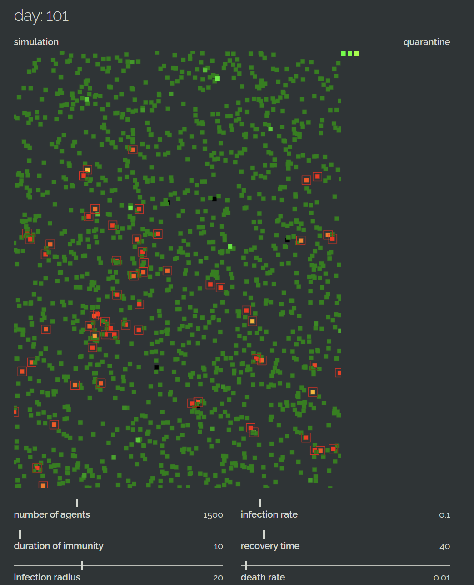

# Pandemic Simulation
> We're all on lockdown, and I need something to do.

 

A simple, interactive simulation of how infectious diseases spread across society. Infected entities have a certain probability of infecting others when close enough. When an infection is detected (a set number of days after first contact), the entities are sent to quarantine until they recover. After recovery, entities gain immunity for a while, which can lead to the extinction of the virus, if it spreads too fast and immunity is long enough.  

Even though it is heavily simplified, the typical exponential spread at the start of an epidemic can be observed.  Parameters like movement speed and social distancing strength, the latter of which was implemented as a simple repulsion force, also impact how the pandemic will evolve.
